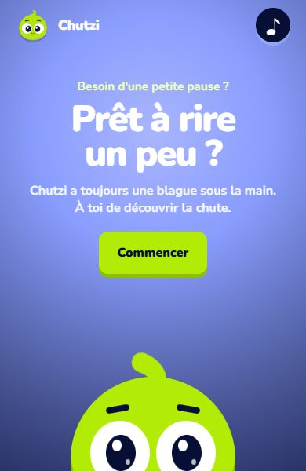
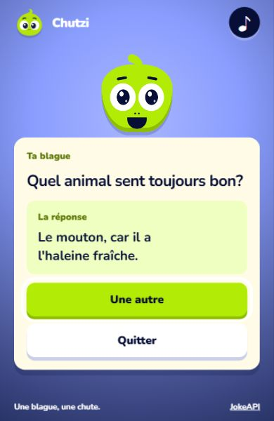
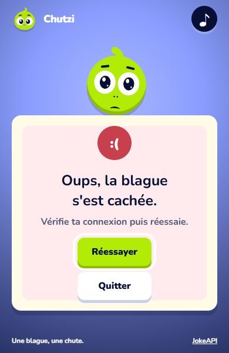
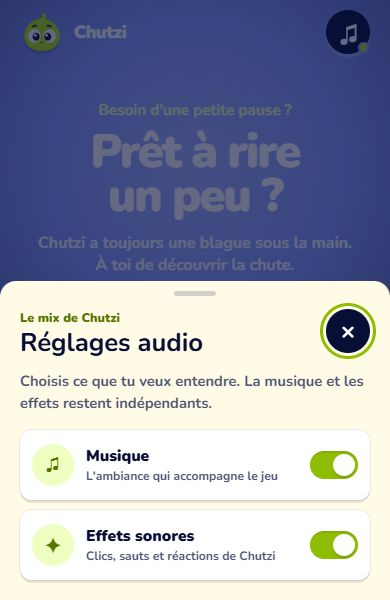
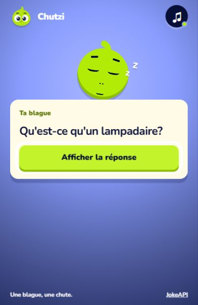
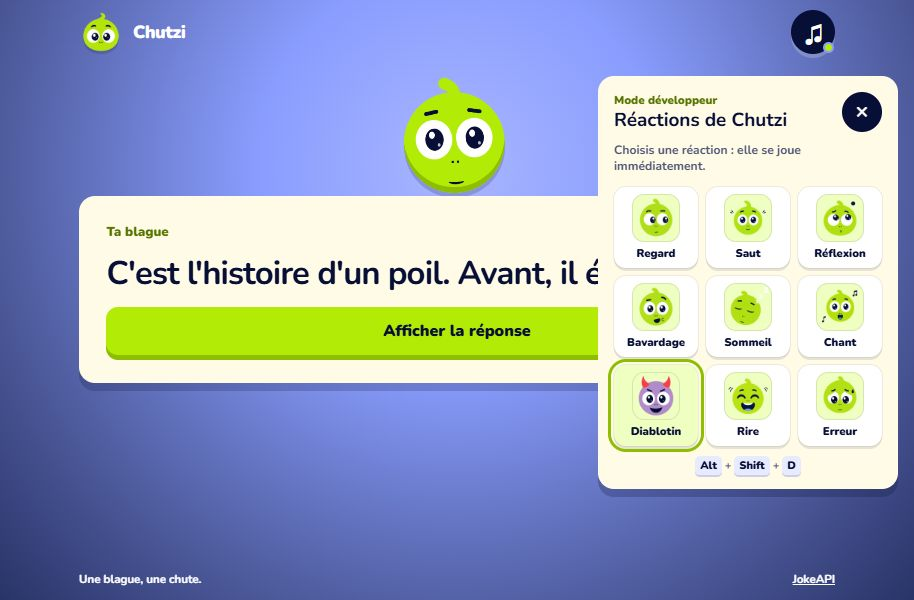

# Chutzi

Chutzi est une mini-expérience gamifiée qui récupère une blague en français depuis JokeAPI. La question apparaît d'abord, puis l'utilisateur révèle la chute avant de demander une autre blague ou de quitter.

## Aperçu

### Accueil



### Blague révélée



### Erreur réseau



### Réglages audio



### Animations surprises

| Diablotin | Somnolence |
| --- | --- |
|  |  |

## Fonctionnalités

- Chargement de blagues françaises avec `fetch`, `async` et `await`
- Sélection de blagues en deux parties : question et réponse
- Filtrage complémentaire des contenus pour conserver une expérience tout public
- États de chargement, résultat et erreur clairement identifiables
- Mascotte animée qui change d'expression selon l'étape et réagit après une période d'inactivité
- Transformation temporaire en diablotin et somnolence avec paupières fermées et « Z » cartoon
- Bouche refermée automatiquement après les réactions vocales
- Musique de fond atténuée automatiquement pendant les réactions sonores
- Lecture musicale en boucle avec redémarrage de sécurité en fin de piste
- Effets contextuels pour les clics, sauts, rires, erreurs et animations surprises
- Réglages indépendants pour la musique et les effets, conservés dans `localStorage`
- Modal audio sur ordinateur et bottom sheet sur mobile
- Interface mobile-first utilisable au clavier
- Réduction des animations selon `prefers-reduced-motion`

## Parcours

1. Cliquer sur **Commencer**.
2. Attendre le chargement de la blague.
3. Lire la question.
4. Cliquer sur **Afficher la réponse**.
5. Choisir **Une autre** ou **Quitter**.

## Mode développeur

Le panneau de prévisualisation des réactions peut être ouvert de deux façons :

- ajouter `?dev=1` à l'URL ;
- utiliser le raccourci <kbd>Alt</kbd> + <kbd>Shift</kbd> + <kbd>D</kbd>.

Après le démarrage du jeu, neuf commandes permettent de déclencher immédiatement le regard, le saut, la réflexion, le bavardage, le sommeil, le chant, le diablotin, le rire et l'erreur.



## Lancer le projet

Le projet utilise uniquement HTML, CSS et JavaScript. Un petit serveur local est recommandé pour les requêtes réseau :

```bash
python -m http.server 8000
```

Ouvrir ensuite `http://localhost:8000` dans un navigateur.

## Structure

```text
blague-aleatoire/
├── index.html
├── assets/
│   ├── audio/
│   ├── css/style.css
│   ├── images/previews/
│   └── js/blague.js
└── README.md
```

## API utilisée

Les données viennent de [JokeAPI](https://jokeapi.dev/), avec la langue française, le format en deux parties et le mode sécurisé activés.
