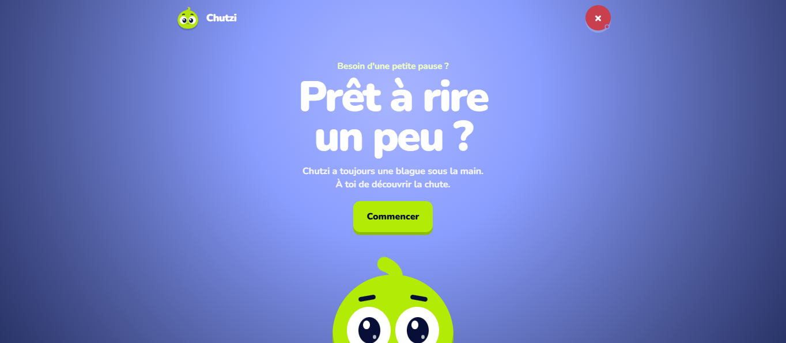
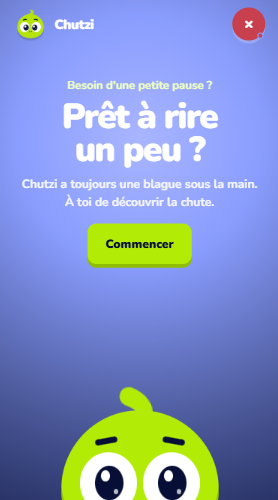

# Chutzi

Chutzi is a small playful experience that retrieves two-part French jokes from JokeAPI. The mascot accompanies every moment with expressive animations, sounds and surprise reactions.



<p align="center">
  
</p>

## Demo

- GitHub Pages: https://osiris-balonga.github.io/chutzi/
- Repository: https://github.com/Osiris-Balonga/chutzi

## Features

- asynchronously retrieves French jokes with `fetch`;
- guides the player from setup to punchline, then to another joke or the home screen;
- applies an additional filter to keep the experience family friendly;
- includes dedicated loading and error states;
- brings an animated mascot to life with contextual reactions and idle animations;
- uses anticipation, squash-and-stretch and a grounded shadow for jumps;
- includes thinking, singing, sleeping, laughing and devil transformations;
- plays looping background music and contextual sound effects;
- stores independent music and effects preferences with `localStorage`;
- uses an audio modal on desktop and a bottom sheet on mobile;
- is mobile-first, keyboard navigable and respects `prefers-reduced-motion`.

## User flow

1. Select **Start**.
2. Wait for a joke to load.
3. Read the setup.
4. Select **Show the answer**.
5. Choose **Another** or **Quit**.

## Technology

- semantic HTML5;
- CSS3 and keyframe animations;
- native JavaScript with ES modules;
- Fetch API and Web Audio through the `Audio` element;
- JokeAPI;
- Google Fonts with the Nunito family;
- Git and GitHub Pages.

No framework, JavaScript dependency or build step is currently required.

## Run locally

The scripts use ES modules, so serve the directory with a static server instead of opening `index.html` directly:

```bash
python -m http.server 8000
```

Then open `http://127.0.0.1:8000/`.

## Architecture

```text
chutzi/
├── assets/
│   ├── audio/
│   ├── css/
│   │   ├── animations.css
│   │   ├── audio.css
│   │   ├── developer.css
│   │   ├── foundation.css
│   │   ├── game.css
│   │   ├── layout.css
│   │   ├── main.css
│   │   ├── mascot.css
│   │   └── responsive.css
│   ├── images/
│   │   ├── brand/
│   │   ├── previews/
│   │   └── reactions/
│   └── js/
│       ├── app.js
│       ├── audio.js
│       ├── config.js
│       ├── developer.js
│       ├── jokes.js
│       └── mascot.js
├── .nojekyll
├── index.html
├── robots.txt
├── site.webmanifest
├── sitemap.xml
└── README.md
```

`app.js` orchestrates the flow. Requests and filtering live in `jokes.js`, audio in `audio.js`, mascot reactions in `mascot.js`, and preview tools in `developer.js`. `main.css` imports the stylesheets in cascade order.

## Developer mode

After a game starts, a panel can trigger Chutzi's nine reactions manually: look, hop, think, chat, sleep, sing, devil, laugh and error.

Open it in either of these ways:

- append `?dev=1` to the URL, for example https://osiris-balonga.github.io/chutzi/?dev=1;
- use the <kbd>Alt</kbd> + <kbd>Shift</kbd> + <kbd>D</kbd> shortcut.


## API and privacy

Jokes come from [JokeAPI](https://jokeapi.dev/) with French selected, the two-part format and safe mode enabled. Only audio preferences are stored locally in the browser; the application does not collect personal data.

## GitHub Pages deployment

The project is ready to publish from the `main` branch and repository root. `.nojekyll` disables Jekyll processing, while `robots.txt`, `sitemap.xml`, the manifest and social metadata target the production URL.

In GitHub, select **Settings → Pages → Deploy from a branch**, then choose the `main` branch and `/ (root)` folder.

## Author

Created by [Osiris Balonga](https://github.com/Osiris-Balonga) as part of Akieni Academy.
